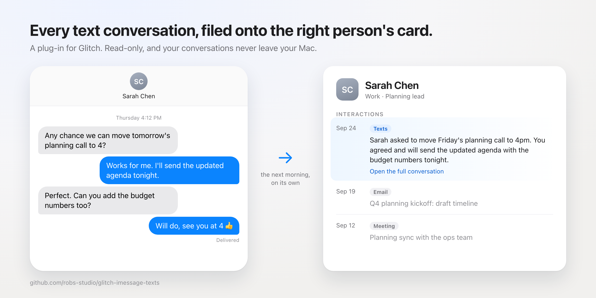

# iMessage texts for Glitch



A plug-in for Glitch, the local-first AI second brain, that files every text conversation onto the right person's card.

**What is Glitch?** Glitch is not publicly available.
Members get it through the Glitch Cat Club community on Skool: [skool.com/glitchcatclub](https://www.skool.com/glitchcatclub).
This plug-in needs a working Glitch install; on its own it does nothing.
It is built by a Glitch member and shared as is: it is not part of Glitch itself.

## What it does

- Reads the texts on your Mac, read-only, and files each day of texting as one dated line on the right person's card in Glitch.
- Keeps each conversation as a private transcript on your Mac, so Glitch can answer "where did we leave off with Sam" from what was actually said.
- Holds numbers it does not know yet on a review list: yes, no, or a name for each, and nobody is added without your yes.
- Writes each day's line in plain words in a summary pass, and runs each morning once you switch that on.

## Requirements

- **A Mac.** It reads the Messages database on macOS. On Windows or Linux it says so and writes nothing.
- **Glitch, up to date.** Run `/update` in Glitch before you install.
- **Full Disk Access for the app Glitch runs in** (Terminal, iTerm, VS Code or the Claude app). Grant it in System Settings > Privacy & Security > Full Disk Access, then quit that app completely and open it again: the permission only reaches a freshly opened app.
- **Messages on the Mac signed in to your Apple ID**, with Messages in iCloud switched on if you want your phone's texts too.
- **Contacts** (optional): with it, texts from saved numbers arrive with a name.

Nothing else: no packages, no keys, no logins. It runs on Glitch's own Python.

## Install

1. Download the latest `glitch-imessage-texts-vX.Y.Z.zip` from the [Releases page](https://github.com/robs-studio/glitch-imessage-texts/releases/latest).
2. Open Glitch and paste this prompt, with the real file name (and path, if you saved it somewhere other than Downloads):

```text
Install the iMessage texts plug-in from ~/Downloads/glitch-imessage-texts-vX.Y.Z.zip.
1. Unzip it so its imessage/ folder becomes _local/imessage/ in my Glitch folder. Write nowhere else. If _local/imessage/ already exists, keep every file in it that the zip does not hold (threads/, synth/, pre-backfill/, ledger.json, ledger.wal, ledger.lock, state.json, config.local.json): those are my texts and my settings.
2. Copy _local/imessage/skill/SKILL.md to .claude/skills/texts/SKILL.md, making the folder if it is missing.
3. Register the skill as mine: uv run --directory .claude/scripts python local_exclude.py register-skill texts
4. Read _local/imessage/README.md, then walk me through its "First run" section one step at a time, starting with check. Wait for me after each step, and change nothing the guide does not name without asking me first.
5. If check says this app needs Full Disk Access, tell me how to grant it and stop there. I will quit and reopen the app, start a new session and ask you to carry on with the first run.
```

3. Start a new Glitch session when it is done, so the `/texts` words load.

## Update

Download the newest release zip from the [Releases page](https://github.com/robs-studio/glitch-imessage-texts/releases/latest), then paste this into Glitch:

```text
Update my iMessage texts plug-in from ~/Downloads/glitch-imessage-texts-vX.Y.Z.zip. Code only.
1. List what the zip holds, then unzip only those files over _local/imessage/.
2. Never touch, move or delete threads/, synth/, pre-backfill/, ledger.json, ledger.wal, ledger.lock, state.json or config.local.json. Those are my texts and my settings.
3. If my _local/imessage/ has a .py file the zip does not, name it and ask me before removing it.
4. Copy _local/imessage/skill/SKILL.md over .claude/skills/texts/SKILL.md.
5. Run the plug-in's status verb and tell me in plain words whether it still works.
6. Check the morning run with morning_reports.py status. An update that changes imdaily.py or capability.json pauses it until I approve it again: if it is paused, ask me before running approve imessage.
```

If the morning brief ever says **"texts paused: the engine changed, update the plug-in"**, that is this update: nothing is lost while it is paused, and it picks up where it stopped.

## Everyday use

Say it in plain words in any Glitch session:

| You say | What happens |
|---|---|
| "bring my texts in" | where things stand: days waiting, days filed, numbers to review |
| "numbers to review" | the review list, top rows first; you say yes, no, or give a name |
| "summarise my texts" | one background helper writes the waiting days' lines |
| "where did we leave off with <name>" | their days of texts, newest first, with the end of each conversation |
| "who texted me yesterday" | everyone your texts hold for that day |
| "don't read texts from <name>" | a preview of putting them on the never-read list; nothing changes until you say yes |
| "fill in my old texts" | a backfill of older texts, always a dry run first with the counts and the time it takes |
| "turn on the texts morning run" | Glitch asks for your yes; from the next morning your texts line is in the morning catch-up |

Every change is previewed first and happens only on your yes.

## Privacy, in plain words

- **It reads Messages read-only.** It never sends a text, never edits one, never deletes one and never marks one read.
- **Your conversations stay on your Mac**, in `_local/imessage/threads/`. The morning run calls no AI model. Glitch reads your texts only in a session you are in: a summary pass you ask for, or a question you ask about someone.
- **Codes and passwords are stripped.** One-time codes, PINs and card numbers are removed before anything is written.
- **Nobody is added on their own.** New numbers wait for your yes.
- **Never zip, copy or share your plug-in folder** (`_local/imessage/`) once you have run it: from the first run on, it holds your text messages. To pass the plug-in on, share the link to this page.
- If you back up your own code with Glitch's `/local-backup`, keep the plug-in's data on your Mac when it asks; the full guide lists each file.

## Known limits

- **Mac only.**
- **A new person from a text takes two yeses**, and their card says they came from a meeting. Both are Glitch quirks this plug-in works around or cannot fix.
- **`/recall` reads a card's 20 most recent lines.** Texts are one line per day, so "where did we leave off" is how to look further back.
- **Redaction is a pattern filter.** Anything that looks like a code, PIN, card number or password is stripped; something private said in ordinary words stays in the transcript, which is why transcripts never leave your Mac.
- **A backfill rolls the undo history** off the cards it touches, so it keeps a copy of each card first; that copy is the way back.
- **A number can reach the wrong card by its last digits.** The review list shows every such match so you can say it is the wrong person.
- **A number with no country code is read as a US number.**
- **Photos and attachments** show as `[photo]`; the files are not kept.
- **Archiving old lines at the end of the year is not built yet.** A busy card grows about 35 KB a year.

## The full guide

[`src/imessage/README.md`](src/imessage/README.md) is the plug-in's own guide, and it ships inside the zip as `imessage/README.md`: what it touches, the first run by hand, every verb, backfill and the way back, excluding someone, the tests, and how to remove it.

## License

MIT. See [LICENSE](LICENSE).

## Author

Rob Kolts ([github.com/robs-studio](https://github.com/robs-studio))
